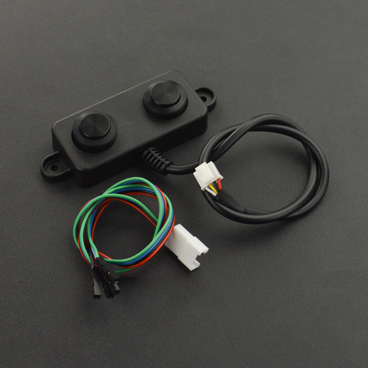

# A02YYUWSensor
A helper class for reading sensor data from [A02YYUW sensor modules](https://wiki.dfrobot.com/_A02YYUW_Waterproof_Ultrasonic_Sensor_SKU_SEN0311) from microcontrollers like an Arduino or ESP.



# About the A02YYUW Sensor
Introduction
Ultrasonic distance sensor determines the distance to a target by measuring time lapses between the sending and receiving of the ultrasonic pulse.

A02YYUW is an waterproof ultrasoinic sensor module with 4.5m effective ranging distance. It supports 3.3~5V wide voltage range and is compatible with 3.3V or 5V device like Arduino, Raspberry Pi, etc. The average current of A02YYUW is only 8mA so it can be powered by most controllers' IO port. The ultrasonic sensor adopts closed separated probe, waterproof and dustproof, which could be well suitable for harsh and moist measuring environment. All the signal processing units are integrated inside the module, so users can directly obtain the distance value through Asynchronous Serial Interface. With 9600bit/s band rate, the sensor can easily communicate with upper-host or other MCU, which greatly shortens the developing cycle for users.

Use the sensor with Arduino controller to build up your projects, such as backing car annunciator, obstacle avoidance robot, object approaching detection etc.

Specification
* Operating Voltage: 3.3~5V
* standby Current: ≤5mA
* Average Current: ≤8mA
* Blind Zone Distance: 3cm
* Ranging Distance for Flat Object: 3-450cm
* Output: UART
* Response Time: 100ms
* Probe Center Frequency: 40K±1.0K
* Operating Temperature: -15~60℃
* Storage Temperature: -25~80℃
* Sensing Angle: 60°
* Protection Rate: IP67

# A02YYUW Pins
| Label | Name | Description |
| --- | --- | --- |
| 1 | VCC | Power Input |
| 2 | GND | Ground |
| 3 | RX | Processed Value/Real-time Value Output Selection |
| 4 | TX | UART Output |

Fun fact: the sensor can be powered by **GPIO Pins** on most Arduino and ESP boards, so you can turn the sensor on and off as you need it.

# Usage example

```cpp
#include <A02YYUWSensor.h>
#include <SoftwareSerial.h>

#define PIN_TX 6 // TX doesn't matter
#define PIN_RX 5

SoftwareSerial softSerial(PIN_RX, PIN_TX); // TX doesn't matter
A02YYUWSensor sensor;

void setup() {
    softSerial.begin(9600);
    sensor.begin();
}

void loop() {
    while (softSerial.available()) {
        char c = softSerial.read();
        sensor.read(c);

        if (sensor.haveVal()) {
            Serial.print((unsigned int)sensor.getVal());
            Serial.println("mm");
            sensor.resetHaveVal();
        }
        if (sensor.getError() != 0) {
            if (sensor.getError() == A02YYUW_ERRORCHECKSUM) Serial.println(F("ERR CHKSUM"));
            if (sensor.getError() == A02YYUW_ERRORLOWLIMIT) Serial.println(F("ERR TOO LOW"));
            if (sensor.getError() == A02YYUW_ERRORHIGHLIMIT) Serial.println(F("ERR TOO HIGH"));
            sensor.resetError();
        }
    }
}
```
